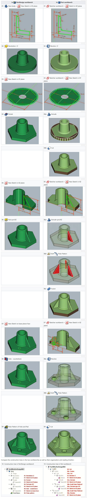

# FreeCAD学习笔记

## 简述及相关网站/学习素材

- FreeCAD：开源免费的参数化建模(Parametric Modeling)软件

- 中文网站（第三方）：[https://www.freecad.com.cn/](https://www.freecad.com.cn/)

- 官方帮助文档：[Online Help Toc - FreeCAD Documentation](https://wiki.freecad.org/Online_Help_Toc)

- 书籍：[请Inventor用FreeCAD](FreeCAD学习笔记_files/请Inventor用FreeCAD.epub)

## 工业建模的逻辑思维

参考：[3D设计软件FreeCAD入门3 两种设计方式 - 知乎 (zhihu.com)](https://zhuanlan.zhihu.com/p/473563739)

“参数化”和“几何图元”两种方法各有优劣，详见后文“PartDesign & Part”部分 

以“几何图元()”思维上手的建模方式在后期面对复杂模型时不可避免要涉及草图(sketcher)处理流程，因此建议统一使用参数化工件建模的二维草图方法入手：

1. 在二维平面(Sketch)绘制二维结构

    如：绘制一个正方形

2. 切换至三维模式，用凸台(Pad)、凹台(Pocket)、旋转体(Revolution)等操作将二维结构变为三维结构

    如：用凸台(Pad)或旋转体(Revolution)操作将正方形变为正方体

3. 选择所创建的三维结构的某个面，继续再该面绘制二维结构

    如：选择正方体上的某个面，在该面绘制一个圆

4. 切换至三维模式，将绘制的二维结构转变为三维结构，从而完成对最初创建的三维结构的改变

    如：用凹台(Pocket)操作将圆变为圆柱体，并实现从正方体上挖去该圆柱体部分

5. 重复上述2步操作，最后完成复杂的工件模型

## FreeCAD工作台（功能模块）简介

1. Arch

    主要用于房屋建筑设计

2. Draft

    简单绘图的二维工具，以及基本的二维CAD工具，是FreeCAD的核心组件
    
3. Drawing

    画图，后期会被TechDraw取代
    
4. FEM

    有限元分析，Finite Element Analysis, FEA

5. Image

    图片处理

6. Inspection

    提取、检查形状的工具，仍在开发中

7. Mesh Design

    点线面（三角网格）的各类处理，部分功能需要安装OpenSCAD

8. OpenSCAD

    直接用一个模块把OpenSCAD整合进FreeCAD里了，可修复构造实体几何（Constructive Solid Geometry, CSG，即体素构造表示形式，将体元根据集合论的布尔逻辑组合在一起）模型

9. PartDesign

    根据草图(sketch)功能构建工件，是FreeCAD的核心组件

10. Part

    几何基元的建模工作台，包含几何布尔运算，是FreeCAD的核心组件

11. Path

    用于生成G-Code指令，仍在开发中

12. Points

    用于处理点云

13. Raytracing

    光追

14. Reverse Engineering

    反向工程，将形状/实体/网格作参数化转换，以与FreeCAD兼容

15. Robot

    研究机器人运动

16. Sketcher

    二维CAD工具，绘制以“几何约束”思维设计的二维草图，是FreeCAD的核心组件

17. Spreadsheet

    用电子表格实现参数列表化，以用于其它工作台的参数约束

18. Start

    初始界面

19. Surface

    创建和修改曲面的工具

20. TechDraw

    从3D模型生成技术图纸的

21. Test Framework

    调试FreeCAD

22. Web

    浏览器窗口

## 部分功能类似工作台的区别

1. Draft & Sketcher

    Draft一般用于绘制简单的平面图形（如绘制建筑平面图形等，后期转Arch工作台联用），其也包含了生成平面文字等功能，不具备约束(constraints)功能

    **Sketcher是专门用于与Part、PartDesign工作台联用以创建工件实体的二维平面图形绘制工具，其具备约束(constraints)功能**

    - **评价约束程度的参数：自由度，Degrees Of Freedom , DOF**

2. PartDesign & Part 

    **PartDesign工作台是符合“参数化工件设计”思维的工作台，基本上可以按照任务视图的基本指引一步一步完成设计（Sketcher → PartDesign，然后往复）**

    - **PartDesign因符合“参数化工件设计”，因此需要立足于“闭合面”（①.要有面，②.面要闭合）生成三维结构，此方面存在较多约束（如模型上刻字，需要把文字转成闭合面格式才能进行进一步处理）**

    Part工作台是符合“几何图元的生成式建模”思维的工作台，更适用于基本几何体（及之间）的简单变化（其建模思路更像Blender）（模型刻字不再有必须闭合面的约束）

    - Part也部分支持Sketcher → Part的建模方式：二维→三维时不支持复杂的生成，只能先生成三维物体后再进行三维物体之间的布尔逻辑处理，此方面使操作变得复杂

    参考：[Part and PartDesign - FreeCAD Documentation](https://wiki.freecad.org/Part_and_PartDesign)

    

## 一些Tips：

1. 参考外部集合体：先创建基准点 / 基准线
