# Git学习笔记

> 写在前面：
> 
> 可用Git进行分布式版本管控的文档格式，不包括word、xlsx、ppt、pdf等富文本文档。
> 
> 富文本文档只能把Git当网盘用，无法发挥Git的最大优势。
> 
> 建议使用.md格式的文档（即markdown文档）以实现对Git的充分利用。

## 1. Git及Git平台简介

### 1.1 Git简介

<details>

Git（音标/gɪt/）是一个**开源的分布式版本控制系统**。

- 所谓“**开源**”，即不存在付费、破解等问题，永久免费自由使用。

- 所谓“**分布式**”，即项目团队成员可以每个人独立/独自完成自己负责的项目分支/分块，然后一键汇总归并。甚至每个人完成一篇文档的一个部分，然后一键跟进即可形成一篇完整文档。而不需要凑在一起或者进行额外的联系协调工作。

  > 这里一定要额外关注的一点是：上述“文档”不支持word、xlsx、ppt、pdf这类富文本文档。只支持txt、md及代码格式的文档。

- 所谓“**版本控制**”，以团队成员共同完成某个文档为例：

  a. 文档文件由组长新建后，Git记录为`版本1`；

  b. 然后成员A在`版本1`基础上写了一些内容并上传，Git记录为`版本2`；

  c. 然后成员B也在`版本1`基础上写了一些内容并上传，此时对于“版本控制”，其实就有3个可能性：

  1. 成员B的上传完全覆盖`版本2`(即覆盖成员A的内容)生成`版本3`，

  2. 在`版本2`基础上增添成员B的内容生成`版本3`，

  3. 上传一个与`版本2`平行的`版本3`。

  **以上3种可能性，Git全部支持，而且操作很方便。**

  不仅如此，因为Git生成了每个版本之间的详细的过程记录，所以大家也可以回查各版本之间究竟修改了什么。并进行自由的版本间操作：

  如上述的可能性中，选择了`3`，即生成了平行的`版本2`和`版本3`，如想将`版本2`和`版本3`合并，可以很方便的以其中一个版本为基础，将另一版本新加的内容添加进去，生成`版本4`。

  再如`版本4`可能存在bug，得益于Git详细记录了版本间的各类信息，所以组长可自由将主版本回滚至`版本1`、`版本2`、`版本3`中的任何一个。

- 所谓“**系统**”，即Git不是一个独立的软件，而是一个“系统”——有各种各样的软件可以接入，去实现Git的功能。

  > 当然前提是得安装Git的底层功能服务。有些软件自带了，相当于帮你安装了，不过大部分软件没有帮你安装，是需要你自己先安装Git底层服务的。

</details>

### 1.2 Git平台简介

<details>

我们使用的**AtomGit**平台就是Git技术的一个具体实现，它作为一个“仓库”，或者说“中转站”，帮助我们实现Git的具体功能。当然除此以外，它也能够实现**项目讨论**、**Pages服务**等其他功能。最重要的是，它作为[OpenAtom开放原子开源基金会](https://www.openatom.cn/about)旗下的平台，它的上述各类服务都是免费的。

除**AtomGit**以外，也有很多Git平台：如微软的[**GitHub**](https://github.com/)就是全球最大的Git平台，其历史久，项目多，功能全，不过国内访问的话网络不稳定（毕竟服务器在国外），会出现时快、时慢、时等、时断的问题。大家有空可以多去[GitHub](https://github.com/)看看，学习学习，有很多好项目可以参考。

> 不过自己做项目的话得考虑Git服务网络稳定性问题，建议自用仓库还是选国内的，公开展示的可以选GitHub。

然后[**Gitee**](https://gitee.com/)、[**GitCode**](https://gitcode.com/)等也是国内知名的Git平台。[**Gitee**](https://gitee.com/)的特点是起步早，在国内知名度大些，国产开源项目多一些，但是免费团队协作服务的上限是5人，再多就要收费。[**GitCode**](https://gitcode.com/)的特点是无人数上限，适合团队项目开发。

> [老GitCode](https://gitcode.net/)是net域名的，我们本次说的GitCode是com域名、服务由华为云提供的。老GitCode用的是很早的GitLab家的服务，目前基本处于停止开发、只剩维保的阶段了，不建议再用了。

另外，[**GitHub**](https://github.com/)上的一些好项目，可以在**AtomGit**（或Gitee、GitCode）平台用`新建项目`-`从GitHub导入`的方法建立备份，以加快访问速度。

</details>

## 2. 安装并配置Git服务

<details>

### 2.1 下载并安装Git底层服务

官网链接：[Git - Downloads](https://git-scm.com/download/)

对于大部分同学，点击网页右侧的“Download for Windows”下载。下载后打开安装文件，一路无脑点“下一步”即可。

完成Git底层服务的安装后，其实就可以使用Git的功能了（当然这会儿是用命令行敲代码用Git。感兴趣的可以参考：[Git命令](https://www.yiibai.com/git/git_config.html）

### 2.2 配置Git

安装完成Git底层服务后，在电脑桌面上右键（Win11系统要按住Shift，同时鼠标在桌面上右键），选“Open Git Bash Here”，会弹出Git的Bash界面如下：

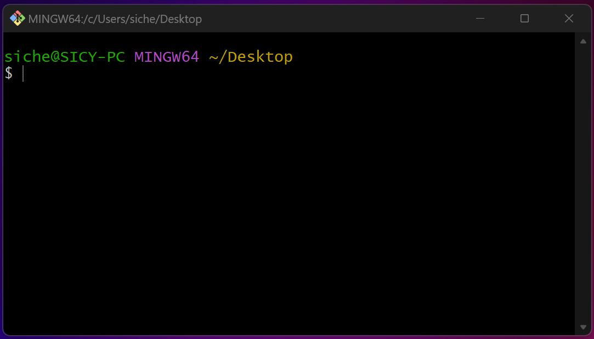

> 因为接下来的配置属于全局配置(global)，所以在哪Bash不影响操作，所以其实也不一定非要在桌面。

第一步先切换成中文：在弹出的GitBash窗口右键，选“option”，然后再在弹出的Option界面里，找到“window”-“UI language”，下拉选择zh_CN，Apply应用或Save保存后，即可切换中文：

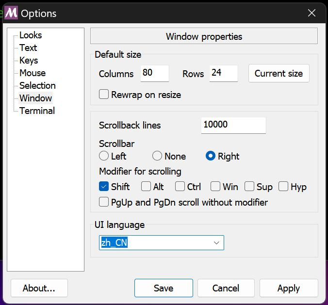

接下来要开始输入一些指令了：

- **配置用户名**。在GitBash窗口输入下述指令，其中“你的用户名”替换成你的用户名（如"SI_Cheng-Yun"），然后敲回车。（用户名一定记得用英文引号包起来）

  ```shell
  git config --global user.name "你的用户名"
  ```

  这行指令的意思是：[Git] [配置] [全局的] [用户的名字] ["你的用户名"]

  因为用户名是以字符串的数据类型存入Git系统的，所以一定要带上英文引号，告诉Git这是字符串，而不是变量。

  这是Git的设计习惯。提交文件的时候，用于记录这是谁传过来的文件。具体设置什么用户名都不影响后续操作。

- **配置用户邮箱**。继续在GitBash窗口输入下述指令，其中“你的邮箱”替换成你的邮箱（如"sichengyun@cpu.edu.cn"），然后敲回车。（用户邮箱一定记得用英文引号包起来）

  ```shell
  git config --global user.email "你的邮箱"
  ```

  > 这行指令的意思是：[Git] [配置] [全局的] [用户的邮箱] ["你的邮箱"]

  因为邮箱是以字符串的数据类型存入Git系统的，所以一定要带上英文引号，告诉Git这是字符串，而不是变量。

  > 用邮箱来标记用户，这是Git的设计习惯。提交文件的时候，用于记录这是谁传过来的文件。具体设置什么用户邮箱都不影响后续操作。

### 2.3 开启数据同步的安全加密通道

承接`2.2`的操作，继续在GitBash窗口输入下述指令，其中“你的邮箱”替换成刚才你输入的邮箱，然后敲回车（记得带上引号）。

```shell
ssh-keygen -t rsa -C "你的邮箱"
```

- 指令解读：

  “ssh”：SSH是一套安全协议。它用SSH密钥（即“ssh-key”）进行文件数据传输。
  
  “gen”是generate的缩写，故“ssh-keygen”意味“生成SSH密钥”。
  
  “-t”是-type的缩写，即指定密钥的类型为“rsa”。
  
  “-”是配置参数相关的标识符，类似于“选项”。“-”是短选项，小选项；如上文的“--global”中的“--”是长选项，大选项/全局选项。

  > 密钥类型有两种，RSA和DSA：
  > 
  > RSA加密算法是一种非对称加密算法，由三位麻省理工人员开发，R、S、A分别是其三人姓氏首字母。
  >
  > DSA：Digital Signature Algorithm（DSA）是Schnorr和ElGamal签名算法的变种。
  > 
  > ssh-keygen指令默认使用的就是RSA密钥，所以其实不加“-t rsa”也行，但如果想生成DSA密钥，就需要加参数"-t dsa"。

  “-C”是-comment的缩写，即指名注释为"你的邮箱"。这将为本次的密钥添加一个以你的邮箱为文本内容的注释，以此区别其他的密钥。

后续一连串的对话框之后，SSH公钥所在的文件目录如下所述。其中，XXXXX.pub文件是公钥，没"pub"的是私钥。

```text
C:\Users\你的windows系统的用户名\.ssh
```

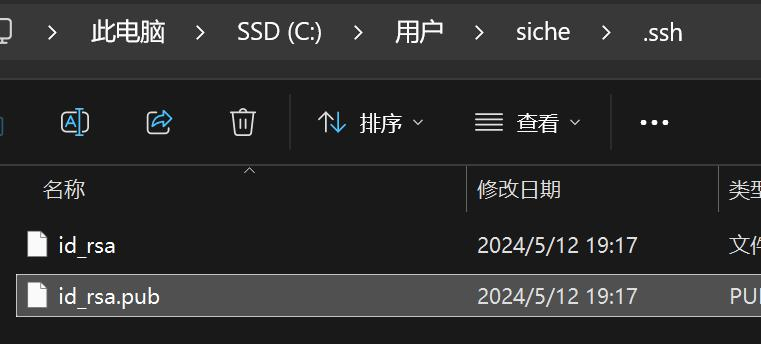

获得XXXXX.pub文件后，用文本文档打开该文件，我们将用此文件的内容来和Git平台建立加密连接。

</details>

## 3. Git平台(网站)操作

### 3.1 在AtomGit平台建立加密连接

<details>

在[AtomGit平台](https://atomgit.com/)注册账号后，在右上角头像点下拉栏里，找到“个人设置”并点击：

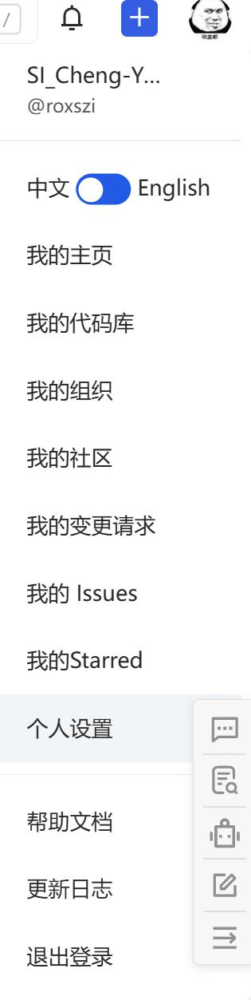

然后在左侧找到“安全中心”-“SSH Keys”并点击：

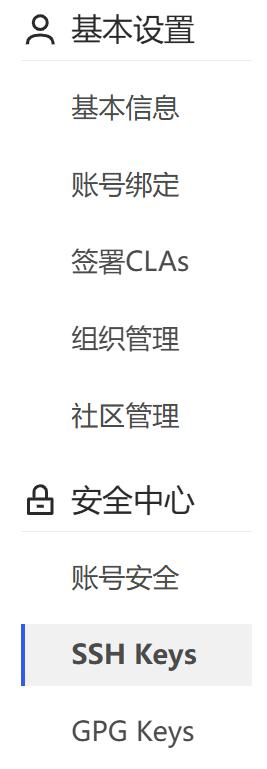

将此前获得的XXXXX.pub文件的内容复制进“公钥”输入框里。公钥名称框可以随便填写，好区分就行。然后点击“添加SSH公钥”即可。

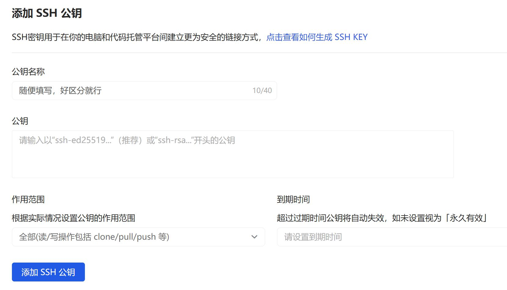

此时，在GitBash窗口输入下述指令，以完成SSH通道的建立：

```shell
ssh -T git@atomgit.com
```

-T即无需与atomgit.com的Git交互（仅检查一下绑定连接）。

在敲回车确认后，即完成SSH通道的建立。

</details>

### 3.2 在AtomGit平台建立仓库

<details>

点击右上角的加号按钮，选择“新建代码库”，

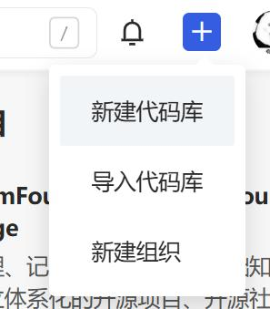

然后会进入“新建代码库”界面，如下图：

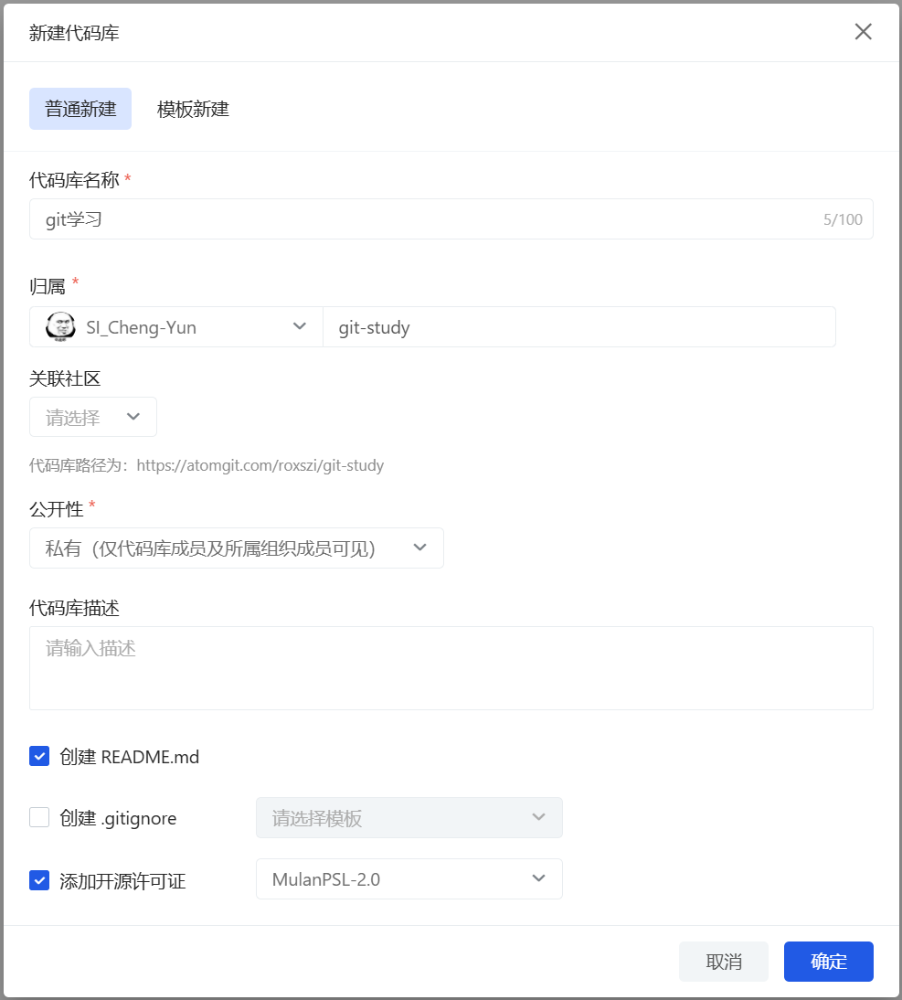

可以参考上图输入仓库的基本信息。这里的几个输入内容解释如下：

- **代码库名称**：这个只是你(或你们团队)自己看的，命名很自由。

- **归属**：这个直接决定这个库的网址。前面那个选项是用户名，如果希望归属为“cpuer”，请联系我；后面那个输入框是这个库真正的名称，会在这个库的网址里出现，要好好想想再填写。

- **公开性**：如果私有，则只有仓库成员能看到仓库的内容（成员也可以修改内容）；如果公开，那么就像个公开网页一样，大家都能看到。

- **代码库描述**：仓库的简单介绍。

- **创建README.md**：就是项目点开之后，出现在首页的介绍文档啊！一定要点上！它给你一个模板，你可以去修改项目主页的介绍。
  
  > .md文件是一个遵循markdown语法的文本文件格式，markdown是一个轻量的“标记”语法，我们这个教程就是用markdown写的。感兴趣的可以搜一下，网上教程很多，10分钟不到就看完了。

- **.gitignore**：顾名思义，就是git的ignore，git服务会忽视掉哪些文件、文件夹。比如`.gitignore`文件里写了个“test”，那么test文件夹、test文件，都不会再同步了。如果是小白的话，可以不点上，也可以点上之后随便选一个，看看它这个文档是什么格式，方便以后用git的ignore功能。

- **添加开源许可证**：这是极为推荐点上的。新建项目，第一时间添加许可证，这是个很好的习惯！然后开源许可证这里建议用[**MulanPSL-2.0**](http://license.coscl.org.cn/MulanPSL2)，木兰宽松许可证(第2版)，它是我们国家自己的开源协议，由[中国开源云联盟](https://www.coscl.org.cn/)起草发布。

设置完成后，点击“确定”，仓库就新建完成了。新建完成的页面如下：

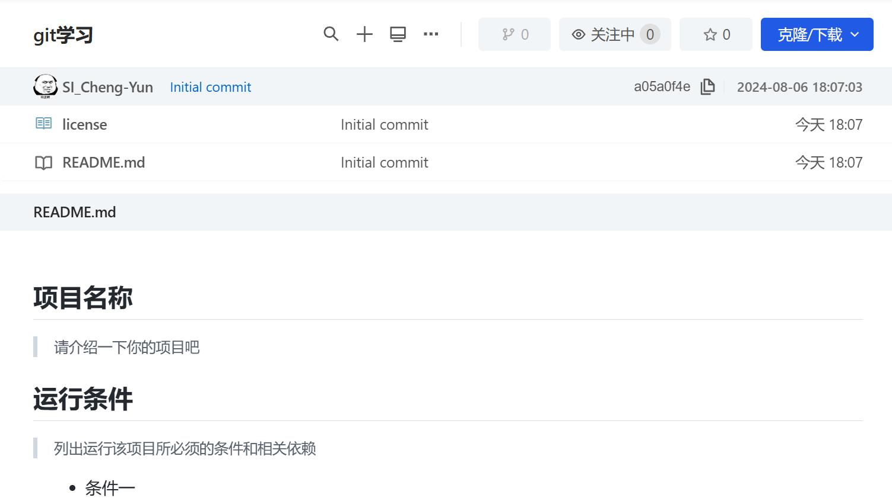

可以看到，仓库里有2个文件。license是许可证文件；README.md文件则是项目介绍文档，项目页面会自动显示介绍文档。

</details>

## 4. Git本地(软件)操作

### 4.1 安装Git本地工具软件

<details>

这里就用[**VSCode**](https://code.visualstudio.com/)演示了。就不折腾别的Git软件了。

下载安装之后，插件里安装中文包即可切换语言为中文。

</details>

### 4.2 用Git工具拉取项目

<details>

这里就用[**VSCode**](https://code.visualstudio.com/)演示了。

> **注意！！！所有同步操作均需要在项目编辑程序不开“运行”、“预览”的情况下进行！（如Cocos Creator等软件，打开软件就会自动开服务器，得完全关闭Cocos Creator才行，不然一堆临时文件，操作麻烦，Git效率很低！）**
> 
> **如果是新建的本地项目，个人建议在网上建个空项目，用IDE拉取本地，然后再把原来的本地项目文件覆盖到拉取下来的空项目里。**

在AtomGit的项目页面，找到“克隆/下载”，选择SSH后点击网址右侧的复制按钮（两页纸的那个按钮）：

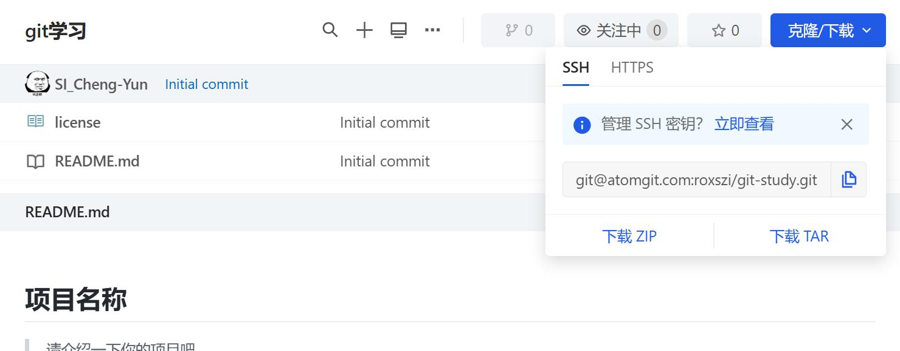

打开VSCode新窗口，在"启动"下找到"克隆Git仓库"：

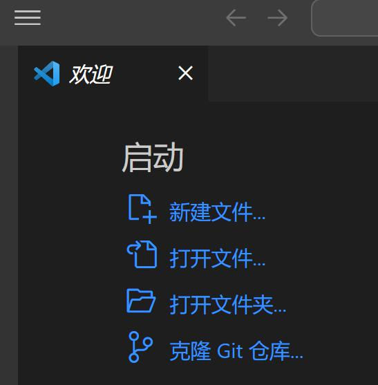

然后建立本地库与远程库的绑定。在中上部弹出的输入框中输入远程库的地址，就是前面得到的所建仓库的Gitee源（SSH协议或HTTPS协议），然后回车。

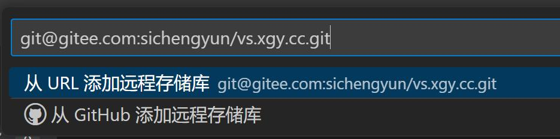

由此，即建立了本地库与远程库的绑定。

（等熟练了，也可以用VSCode初始化Git，然后添加远程库，然后切换远程库）

</details>

### 4.3 实现个人（或团队协同）管理项目

0. **Git原理**：

    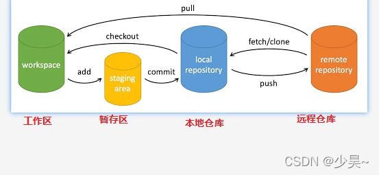

    在VSCode上，“add”就是“＋”按钮，即暂存；“commit”就是“提交”按钮；“push”就是“同步更改”或即“推送”。

    打开VSCode之后第一件事是先看看网络源远程库有没有新内容。

    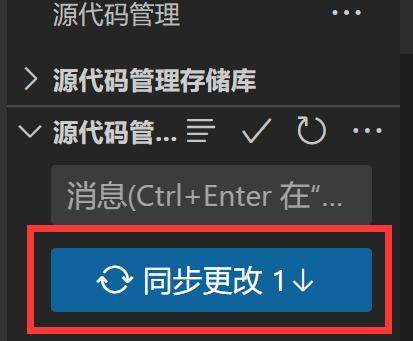

    如果远程库有改动（团队成员提交的)，此时会有“同步更改↓”（注意此处箭头向下），点击即可。

1. **正常工作，写代码/修改内容。**
 
2. **“＋”暂存按钮。**

    在“源代码管理”页面，点击“更改”那里的“+”号暂存。

    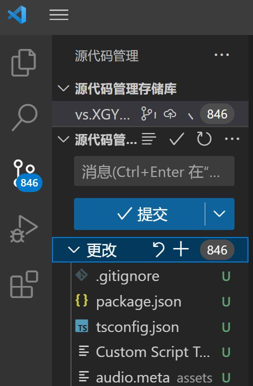

    有些冗余文件不需要提交，可以用“添加到.gitignore”来处理。

    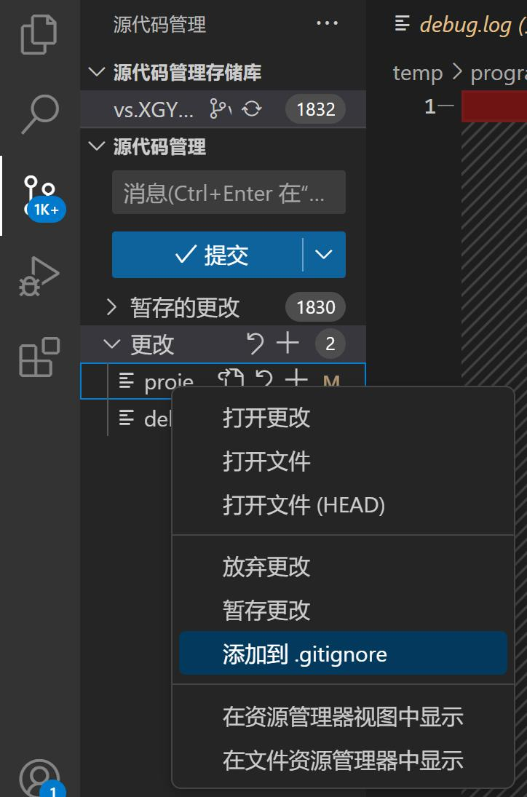
    
    （以后习惯了，其实可以跳过这一步，直接点“提交”，一股脑提交掉）

3. **“提交”按钮。**

    点击图中“源代码管...”右侧的“√”将暂存的更改提交本地库。
    
    其实这个时候点击“√提交”按钮能一键提交到本地库。

    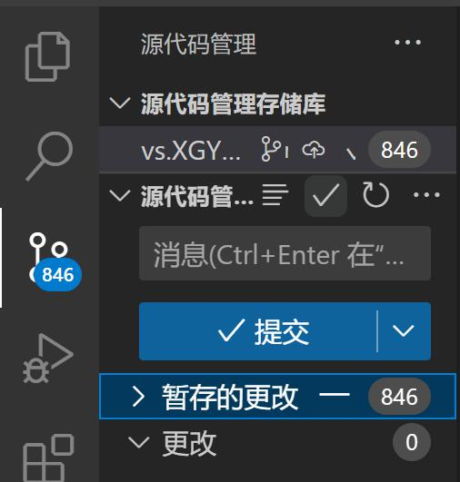

    - 在弹出的“COMMIT\_EDITMSG”文件中输入本次提交的附言，个人习惯以“日期版本.姓名.修改内容”附言，即如“230328a.SIChengYun.balabala”

    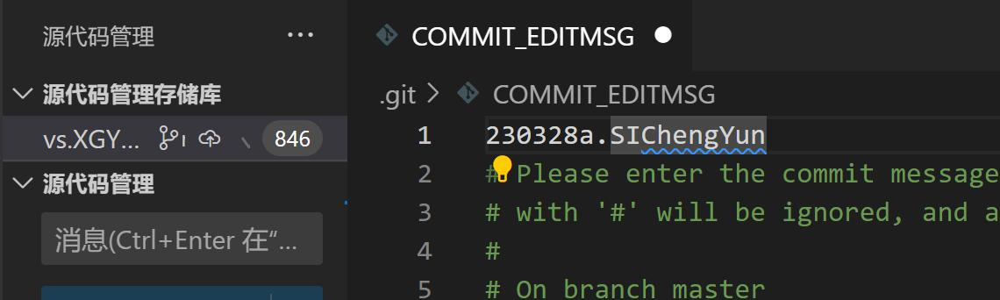

    - 填写好附言，点击“COMMIT\_EDITMSG”文件右边的“√”，并在后续的弹出框中点击确认。

    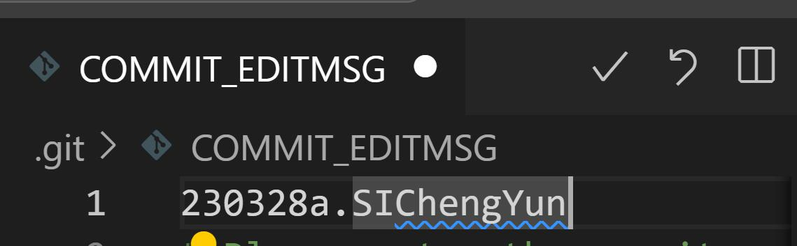
    
    （以后习惯了，其实可以在“源代码管理”下方的输入框里直接输入提交附言）

4. **【重要】代码修改完成之后，提交并同步到远程仓库之前，务必检查一下有没有同事也做了提交。方法就是点“拉取(变基)”。**

    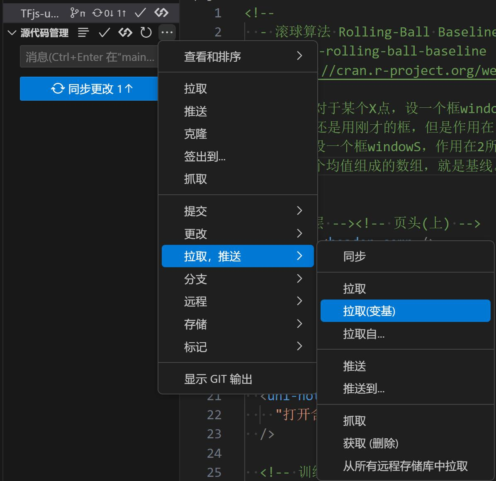

    变基分支，等价于命令行代码```shell pull --rebase --autostash```，即告诉Git，以远程端最新的版本作为参考，来比较你的代码的修改内容。

    此操作是为了提前找到冲突，避免冲突，极为重要。（比如你的同事也修改了同样的文件，而修改的代码还和你修改的不一样，那位同事在你之前提交了，那么就会出现冲突）


5. **“同步更改↑”按钮。**

    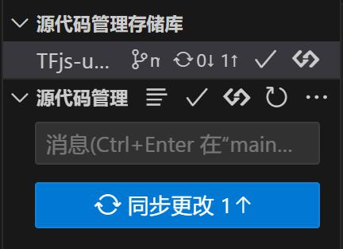

    注意此处“同步更改↑”箭头向上。

6. **完毕！**
