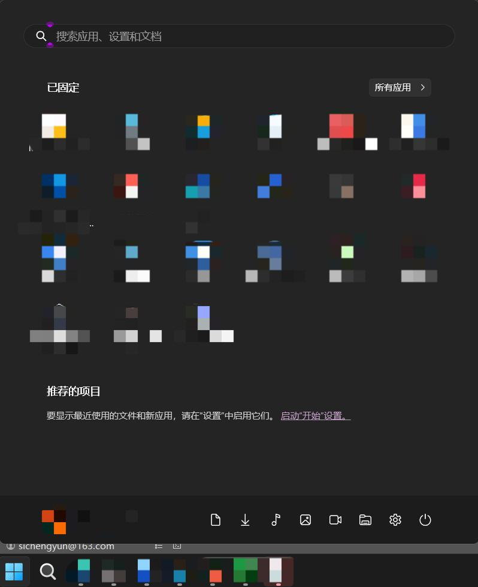
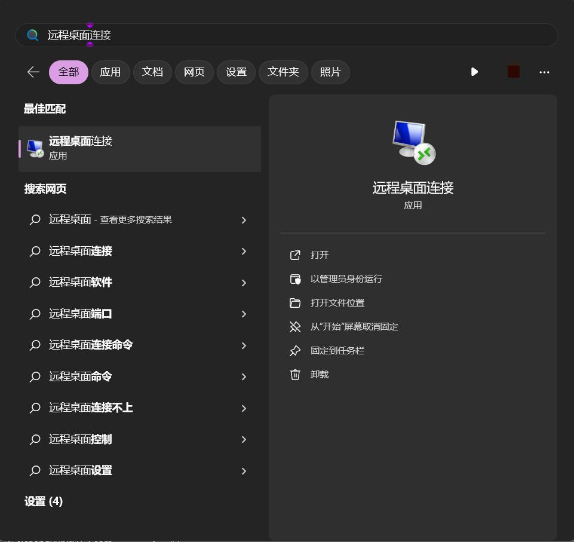
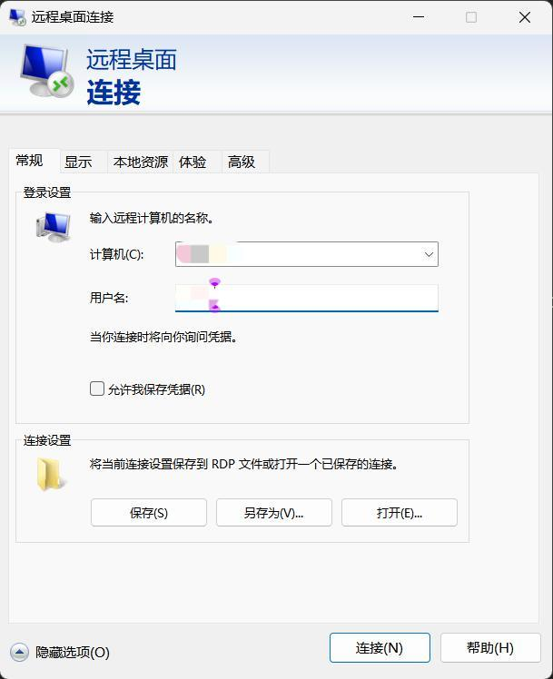
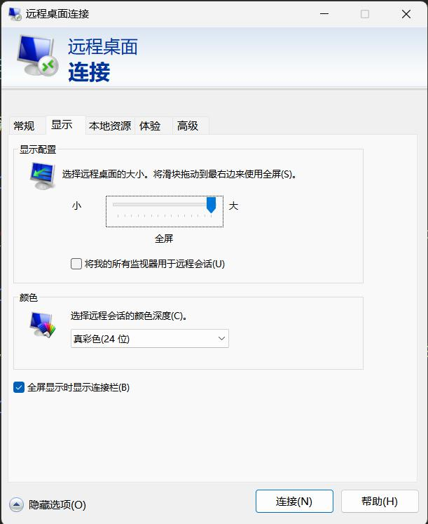
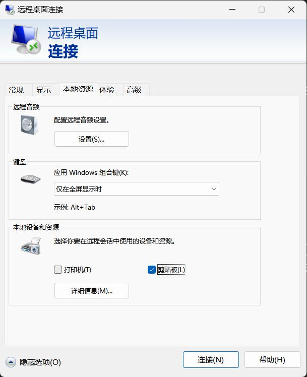
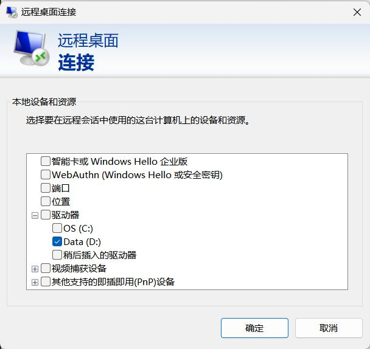
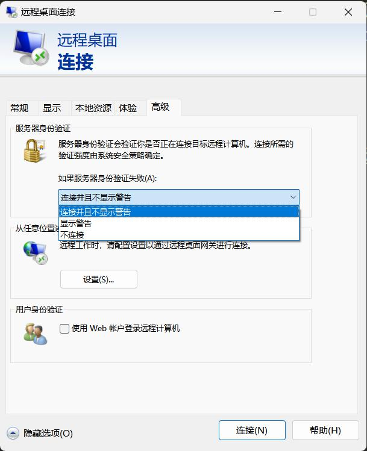
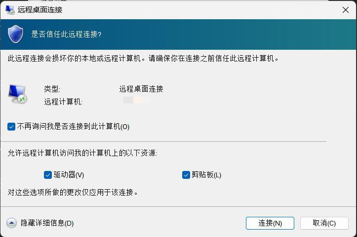
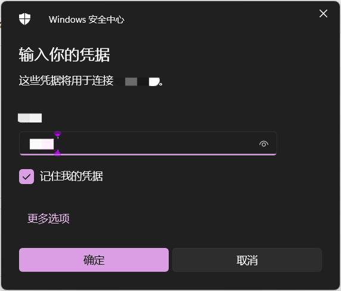

# 远程桌面使用方法

1. 点击电脑任务栏的“田字格”图标(即“开始”按钮)

    

2. 在上部的搜索框里输入“远程桌面”，找到远程桌面程序并打开

    

3. 输入计算机和用户名。计算机可以为IP地址（如192.168.1.101），也可以为计算机的名称（前提是你登录了微软账号）

    

4. “显示”-“颜色”选“真彩色24位”，不然可能会卡

    

5. “本地资源”-“本地设备和资源”建议取消打印机，勾选剪贴板。这样远程计算机不需要访问本地打印机，而本地复制/剪切的内容可以在远程直接粘贴。然后点击“详细信息”

    

6. 建议只选中自己本地最常用的硬盘（如D盘，这样方便在远程计算机里直接访问拉取D盘的数据）

    

7. “高级”-“服务器身份验证”选择“连接并且不显示警告”。设置完成后点下面的“连接”

    

8. 会跳出警告框，点击“连接”即可

    

9. 跳出的密码输入界面，输入用户密码

    

10. 你将进入远程桌面！可以使用Gaussian等软件，退出远程桌面不影响远程电脑的运算
